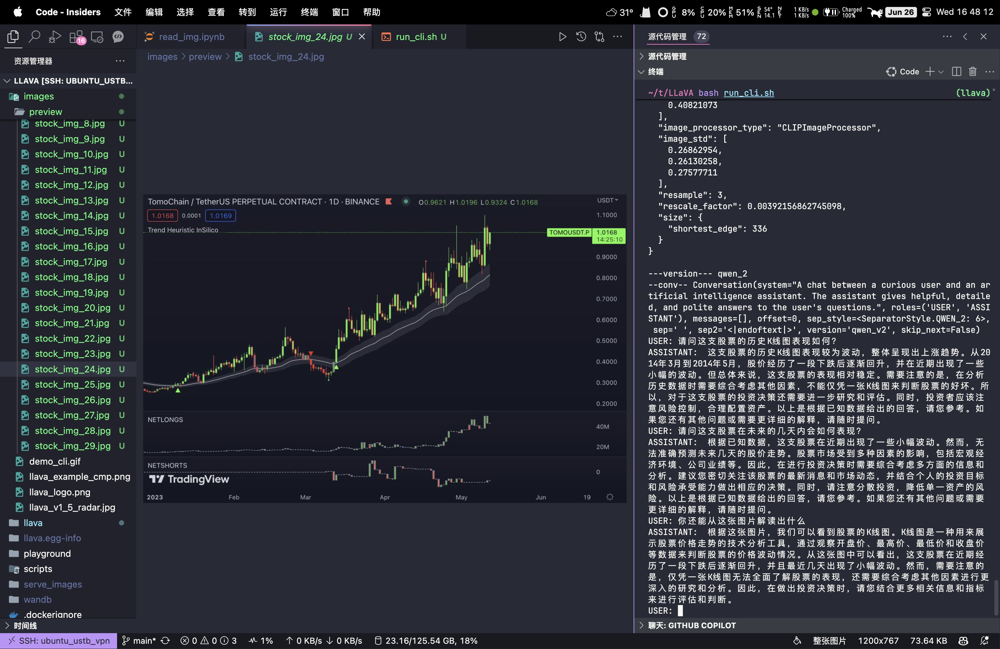

# LLaVA-Qwen2: Enhanced with Qwen2 Base Model

*Visual instruction tuning towards large language and vision models with GPT-4 level capabilities, enhanced with the Qwen2 base model.*

For more details on usage, refer to the original [LLaVA repository](https://github.com/haotian-liu/LLaVA). This custom repository specifically integrates the Qwen2 base model to leverage its advanced capabilities.

## Dataset for Pretraining and Finetuning

[LLaVA Dataset](https://github.com/haotian-liu/LLaVA?tab=readme-ov-file#visual-instruction-tuning) + [FinVis Dataset](https://huggingface.co/datasets/wza/FinVis)

## Download

```bash
git lfs install
git clone https://www.modelscope.cn/TobyYang7/llava-qwen2-1.5b-instruct-finvis.git
```

## MMMU Eval

Download the [MMMU](https://huggingface.co/datasets/MMMU/MMMU/tree/main) dataset first and rename it as `MMMU_eval\data`. For more details, you need to follow the official instructions [here](https://github.com/MMMU-Benchmark/MMMU/tree/main/eval).

```bash
bash eval.sh
```

<details>
<summary>LLaVA-Qwen2-1.5B Result</summary>

| Subject                                |   Data Num |   Acc |
|----------------------------------------|------------|-------|
| Overall-Art and Design                 |        120 | 0.217 |
| Art                                    |         30 | 0.367 |
| Art_Theory                             |         30 |   0.2 |
| Design                                 |         30 |   0.2 |
| Music                                  |         30 |   0.1 |
| Overall-Business                       |        150 |  0.22 |
| Accounting                             |         30 | 0.267 |
| Economics                              |         30 | 0.167 |
| Finance                                |         30 | 0.167 |
| Manage                                 |         30 | 0.167 |
| Marketing                              |         30 | 0.333 |
| Overall-Science                        |        150 | 0.253 |
| Biology                                |         30 | 0.233 |
| Chemistry                              |         30 | 0.167 |
| Geography                              |         30 | 0.133 |
| Math                                   |         30 | 0.333 |
| Physics                                |         30 |   0.4 |
| Overall-Health and Medicine            |        150 | 0.333 |
| Basic_Medical_Science                  |         30 | 0.367 |
| Clinical_Medicine                      |         30 |   0.3 |
| Diagnostics_and_Laboratory_Medicine    |         30 |   0.2 |
| Pharmacy                               |         30 | 0.367 |
| Public_Health                          |         30 | 0.433 |
| Overall-Humanities and Social Science  |        120 | 0.433 |
| History                                |         30 | 0.433 |
| Literature                             |         30 | 0.433 |
| Sociology                              |         30 |   0.5 |
| Psychology                             |         30 | 0.367 |
| Overall-Tech and Engineering           |        210 | 0.262 |
| Agriculture                            |         30 | 0.333 |
| Architecture_and_Engineering           |         30 | 0.233 |
| Computer_Science                       |         30 | 0.333 |
| Electronics                            |         30 |   0.2 |
| Energy_and_Power                       |         30 | 0.233 |
| Materials                              |         30 | 0.233 |
| Mechanical_Engineering                 |         30 | 0.267 |
| Overall                                |        900 | 0.282 |

</details>

## Pretrain Qwen2

```bash
bash pretrain_qwen2.sh
```

The checkpoint for the pretrain projector is located at `checkpoints/Qwen2-1.5B-Instruct-pretrain-FinVis/mm_projector.bin`

## Finetune Qwen2

```bash
bash ft_qwen2.sh
```

## Interface

```bash
bash run_cli.sh
```



## Installation

This repository builds upon the original LLaVA project, integrating the Qwen2 base model for improved performance.

If you are not using Linux, do *NOT* proceed, see instructions for [macOS](https://github.com/haotian-liu/LLaVA/blob/main/docs/macOS.md) and [Windows](https://github.com/haotian-liu/LLaVA/blob/main/docs/Windows.md).

1. Clone this repository and navigate to the custom LLaVA folder

    ```bash
    git clone https://github.com/TobyYang7/Llava_Qwen2.git
    cd Llava_Qwen2
    ```

2. Install Package

    ```shell
    conda create -n llava python=3.10 -y
    conda activate llava
    pip install --upgrade pip  # enable PEP 660 support
    pip install -e .
    ```

3. Install additional packages for training cases

    ```shell
    pip install -e ".[train]"
    pip install flash-attn --no-build-isolation
    ```
